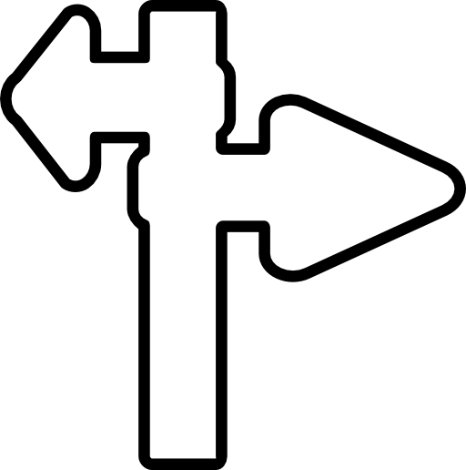
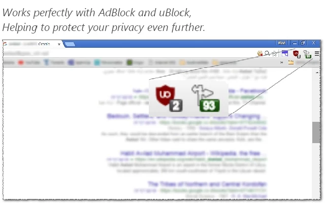
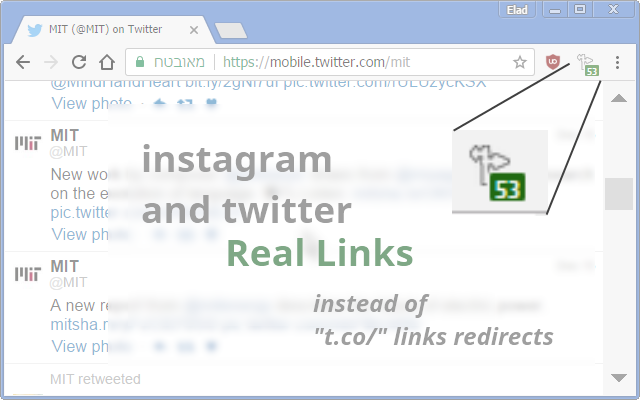
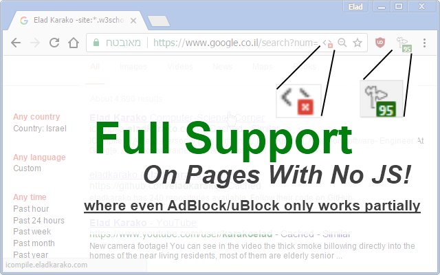

<h1>  Chrome-Extension-Remove-Rude-Redirects</h1>

<h2>A Complementary Chrome-Extension For <a href="https://chrome.google.com/webstore/detail/cjpalhdlnbpafiamejdnhcphjbkeiagm">uBlock Origin</a> and <a href="https://chrome.google.com/webstore/detail/gighmmpiobklfepjocnamgkkbiglidom">AdBlock</a></h2>



<h4>Remove Rude Redirects, That Are Hidden in OnMouseDown Events And That Are Modifying The HREF Property On-The-Fly. Common In All Of Google-Search, Outbrain And Taboola Crappy Recommendations, The Extension Also Tells You How-Much Redirects Were Hidden In The Page And Were Removed :]</h4>





<h3>This Extension Is A Great Way To Protect Your Privacy.</h3>


<hr/>

###If You Like It, Show It, <a target="_blank" href="https://www.paypal.com/cgi-bin/webscr?cmd=_donations&amp;business=7994YX29444PA&amp;lc=US&amp;item_name=Elad%20Karako&amp;item_number=stackoverflow%2dcoffee%2dicon&amp;amount=0%2e50&amp;currency_code=USD&amp;bn=PP%2dDonationsBF%3abtn_donateCC_LG%2egif%3aNonHosted" rel="nofollow">By A Small Donation Using PayPal</a>. Thank You.

<hr/>

```
Developer's HUB / Changelog

1.6.0.6
+ engine upgrade: replace short-links in instagram and twitter ("t.co/...") with real-links!

1.5.5.1
+ handling static Google-redirect-url ("/url?q=...[real URL here]...&...") used (usually)
  on pages without JavaScript.
* project structure change, providing overall performances improvement.

1.5.4.5
+ adding another nasty way some websites changes the URL by directly modifying window.location.

1.5.4.3
* modify structure, improving the window/self isolation, since the algorithm runs in
  each frame in the page, thus addressing only a specific global-scope.
* improving overall algorithm speed, by running DOM-heavy-operations on synchronously-pool.

1.5.3.1
- removing project load on idle state (window.load) in favor of end state (DOMContentLoaded) 
+ adding repeat fix, for pesky websites that overwrite the fix :]

1.4.3.1
- removing handling the request-headers at all(!)
  Since Google-Chrome only allows a single-extension to handle each header(s),
  trying to modify a request-header that has changed by another extension will either break
  this or the other extension.
- (as a result) removing some extension permissions, now unneeded.
- (as a result) removing some project resources, now unneeded.
* project load state: repeating the fix, on page's loading-states, for dynamic websites.

1.4.2.1
* updating main-query's efficiency, targeting link-like elements,
  with 'href' attributes only, to avoid div with 'window.open' actions.
+ try/catch to avoid errors when user close a tab midpoint loading, on header-modification phase.
+ handling "Google-Images", providing direct access to either original page or original image,
  this significantly accelerating the entire Google-Images page! hurrah!

1.4.1.3
* updating main-query, to handle common cases where 
  'window.open' overrides default click (click jacking),
  protecting against pop-up in many malicious websites.

1.3.1.1
- removing permissions: declarativeWebRequest, gcm, activeTab,
  experimental, webNavigation, nativeMessaging, 
  used by my extension-template.
* update conditions, to handle pages where elements were 
  placed in improper locations (for example not BODY)

1.3.0.2
* updated GitHub project URL.

1.3.0.1
+ basic Google-Search redirect events cleanup.
+ header modification to allow running cleanup on every page.
```
